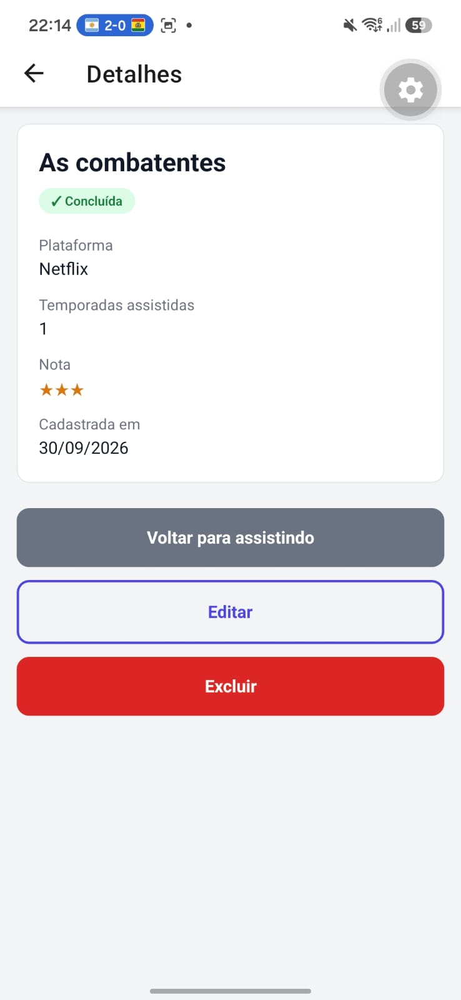

# Minhas Séries

App mobile para registrar as séries que estou assistindo ou já terminei. Permite cadastrar, editar, excluir, marcar como concluída e filtrar entre todas, assistindo e concluídas. Os dados ficam salvos localmente em SQLite.

Feito com React Native, Expo, Expo Router, NativeWind, TypeScript e expo-sqlite.

## Como rodar

```bash
npm install
npx expo start
```

Depois, escaneie o QR Code com o app Expo Go.

## Teste de persistência

Cadastrei 3 séries, concluí uma, editei outra, fechei o app completamente e abri de novo.

**Antes de fechar:**


**Depois de reabrir:**



**Filtro "Concluídas" funcionando após reabrir:**


## Diário do copiloto

### Registro 1 — Etapa 1
**O que eu pedi:** explicação do erro `Cannot find module 'babel-preset-expo'` que apareceu ao rodar `npx expo start -c`, logo depois de criar os arquivos de configuração do NativeWind.
**O que a IA sugeriu (resumo):** o `babel.config.js` que a própria IA tinha passado usa o `babel-preset-expo`, mas o template novo do Expo não declara esse pacote no `package.json`. A solução sugerida foi instalar com `npx expo install babel-preset-expo`.
**O que eu fiz:** corrigi. A configuração sugerida pela IA estava incompleta e o app não subia. Instalei com `npx expo install` (e não com `npm install`) para pegar a versão compatível com o SDK, como visto em aula. Depois disso a tela "Configuração OK" apareceu.

### Registro 2 — Etapa 2
**O que eu pedi:** explicação do erro `TS2882: Cannot find module or type declarations for side-effect import of '../global.css'` no `npx tsc --noEmit`.
**O que a IA sugeriu (resumo):** as versões novas do TypeScript verificam imports que só executam um arquivo, como o do CSS. Como quem processa o CSS é o Metro com o NativeWind, o TypeScript não sabe o que é um `.css`. A sugestão foi adicionar `declare module '*.css';` no `nativewind-env.d.ts`.
**O que eu fiz:** corrigi. O erro veio da configuração da Etapa 1, que a IA tinha passado sem essa declaração, e só apareceu quando rodei o `tsc` pela primeira vez. Adicionei a linha e o `tsc` passou sem erros.

### Registro 3 — Etapa 3
**O que eu pedi:** como fazer o `getDatabase()` com singleton.
**O que a IA sugeriu (resumo):** guardar numa variável a Promise da conexão (`dbPromise`), e não a conexão pronta, usando `openDatabaseAsync`. Assim, se duas telas chamarem `getDatabase()` ao mesmo tempo, as duas recebem a mesma Promise e o banco não é aberto duas vezes.
**O que eu fiz:** aceitei, porque entendi que guardar só a conexão pronta deixaria uma brecha: enquanto o banco ainda estivesse abrindo, uma segunda chamada abriria outro. Também conferi que é a API nova do `expo-sqlite` (`openDatabaseAsync`) e não a antiga (`openDatabase`).

### Registro 4 — Etapa 4
**O que eu pedi:** como montar as queries do repositório e como inverter o status de concluída.
**O que a IA sugeriu (resumo):** todos os valores vindos de variável entram com `?` e vão separados num array, para evitar SQL Injection. O filtro é resolvido no SQL com `WHERE concluida = ?`. Para alternar o status, usar `UPDATE series SET concluida = 1 - concluida WHERE id = ?`.
**O que eu fiz:** aceitei. Com `${}` o valor viraria parte do comando SQL, e com `?` o SQLite trata sempre como dado. O `1 - concluida` transforma 0 em 1 e 1 em 0 sem precisar buscar a série antes. O `0` fixo no `INSERT` não usa `?` porque não vem de variável.

### Registro 5 — Etapa 5
**O que eu pedi:** como fazer a lista recarregar ao voltar do formulário.
**O que a IA sugeriu (resumo):** no Stack, a lista não é desmontada quando outra tela abre por cima, então o `useEffect` com `[]` não roda de novo ao voltar. O `useFocusEffect` roda toda vez que a tela ganha foco. Ele precisa do `useCallback` porque, sem ele, uma função nova seria criada a cada renderização, o efeito rodaria de novo, o `setSeries` causaria outra renderização e viraria um loop infinito.
**O que eu fiz:** aceitei e usei na lista e no detalhe. No detalhe também é necessário, porque ao voltar da edição a tela precisa mostrar os dados novos. Com a dependência `[filtro]`, a lista também recarrega ao trocar o filtro.

### Registro 6 — Etapa 6
**O que eu pedi:** como validar o campo de temporadas no formulário.
**O que a IA sugeriu (resumo):** o `TextInput` sempre entrega string, então guardar como texto e converter com `Number()` só na hora de salvar, verificando se não está vazio, se é inteiro e se é maior ou igual a 0.
**O que eu fiz:** aceitei. Entendi que a checagem de campo vazio é necessária porque `Number('')` dá `0`, então um campo em branco passaria como "0 temporadas". O `Number.isInteger` barra valores como `2.5` e `NaN`.